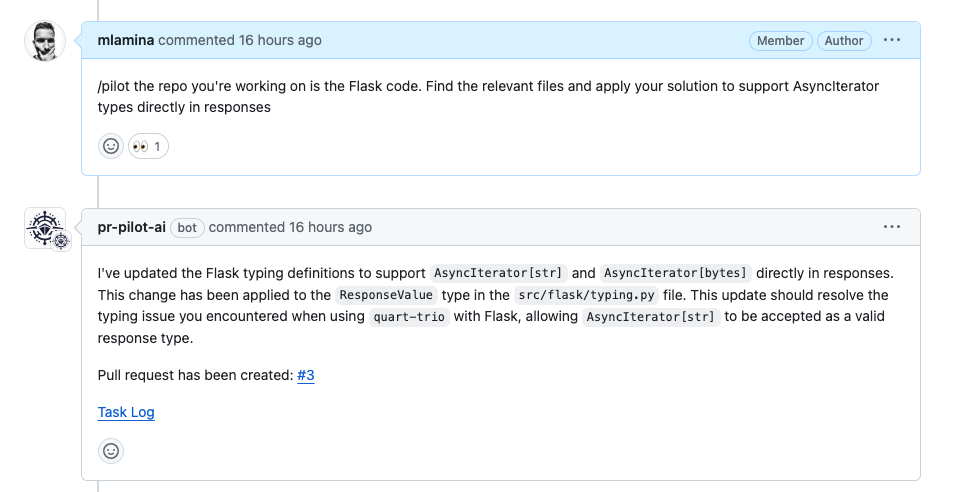
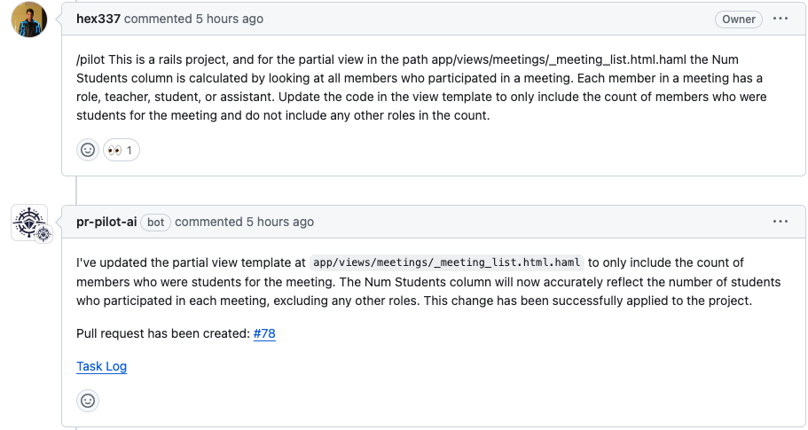
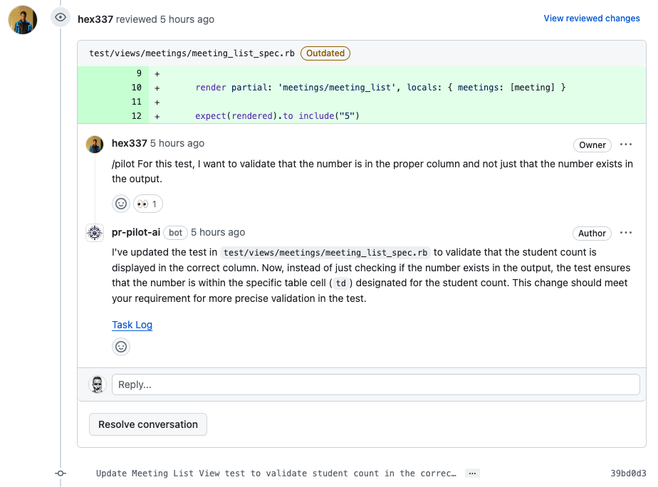
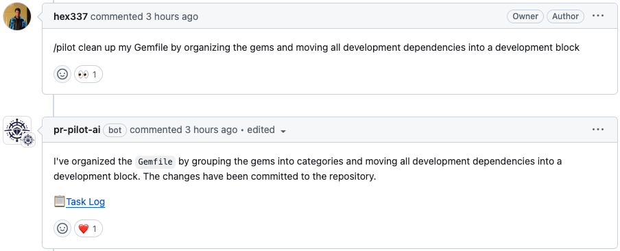
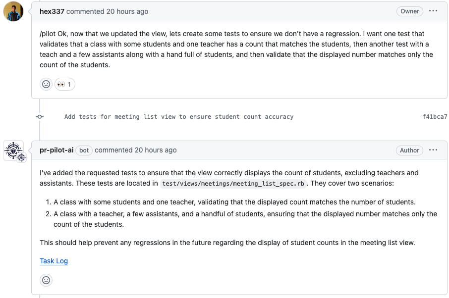

(examples)=
# Usage Examples

This page demonstrates how you can put **PR Pilot** to work.

## Investigate and Fix a Bug

[pallets/flask](https://github.com/PR-Pilot-AI/demo-flask/issues/2)

If well-written, bug reports are detailed, contain code examples and a stack trace - enough context for PR Pilot to investigate the issue,
understand the problem and try to provide a solution.

The result of this collaboration is a [pull request](https://github.com/PR-Pilot-AI/demo-flask/pull/3) that fixes the issue.

## Implement a Change Request

[hex337/quantum-attendance](https://github.com/hex337/quantum-attendance/issues/10)

In this example, there is a change request in form of a Gihub issue.
Just tell **PR Pilot** what you want the result to look like and it will understand and implement the changes.

There's the PR with your changes. If something's not quite right,
just add **a review comment** and **PR Pilot** will understand and make the necessary changes.

## Organize Dependencies

[hex337/quantum-attendance](https://github.com/hex337/quantum-attendance/pull/79#issuecomment-1994839218)

Does your dependency file need some cleaning up? Just tell **PR Pilot** to take care of it.

## Generate Unit Tests

[hex337/quantum-attendance](https://github.com/hex337/quantum-attendance/pull/78#issuecomment-1992749255)

In this example, **PR Pilot** adds unit tests to an existing PR for a Ruby on Rails application.

