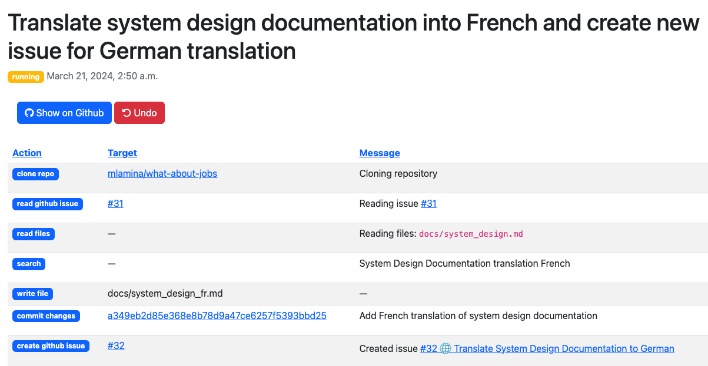

# How it works
**PR Pilot** behaves like any other user on GitHub. It reads and writes to issues and PRs, and communicates with you through comments.

## How to use it

To get **PR Pilot** to do something, you just need to say `/pilot <command>` in a comment on an issue or PR.

The bot will add a 👀 reaction to your comment so you know it's working on it.
    
When it's done, **PR Pilot** will respond with a comment that contains the result of the command.

While it is executing the task, it will create events that you can follow in the [dashboard](https://app.pr-pilot.ai):

## How it works under the hood

TODO: Add a diagram of the architecture of PR Pilot