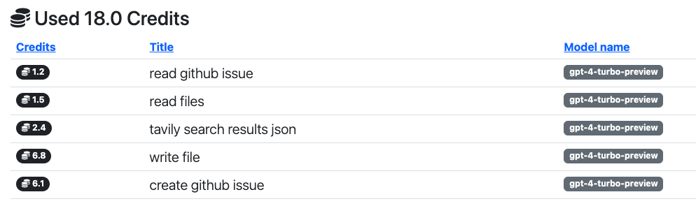

# How it works
**PR Pilot** behaves like any other user on GitHub. It reads and writes to issues and PRs, and communicates with you through comments.
For examples, check out our [Demo Project](https://github.com/mlamina/what-about-jobs/issues/1).

## Have a Conversation

To get **PR Pilot** to do something, you just need to say `/pilot <command>` in a comment on an issue or PR.

The bot will add a 👀 reaction to your comment so you know it's working on it.
    
When it's done, **PR Pilot** will respond to you.

## Collaborate
You can also talk to **PR Pilot** in PR reviews.

## Monitor
While a task is running, **PR Pilot** will create events that you can follow in the [dashboard](https://app.pr-pilot.ai):

You'll also get a detailed overview of how your credits were spent.

## Teach
You can "teach" **PR Pilot** by populating a `pilot-hints.md` file in your repository, allowing you to control 
what it "knows" and how it behaves.

