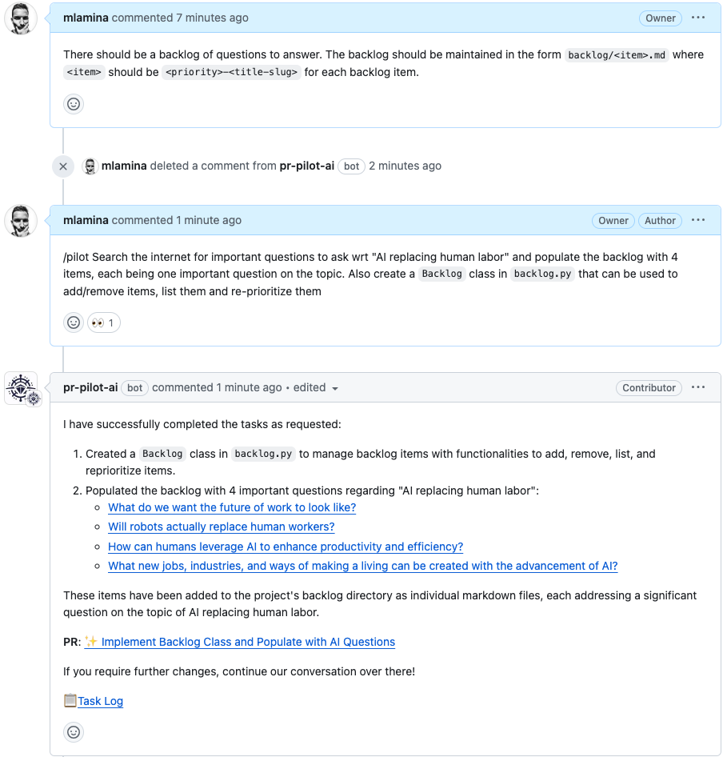

.. PR Pilot documentation master file, created by
   sphinx-quickstart on Tue Mar  5 20:35:25 2024.
   You can adapt this file completely to your liking, but it should at least
   contain the root `toctree` directive.

PR Pilot
========

PR Pilot is an AI collaborator for Github issues and pull requests. Once installed in your repository, you can use  `/pilot <command>` in any issue/PR comment to collaborate. PR Pilot will interpret the command in the context of your code and do research, answer questions or write code for you.

.. toctree::
   :maxdepth: 0
   :hidden:

   quickstart
   how_it_works
   capabilities
   examples
   vision
   roadmap
   comparison
   pricing
   privacy_notice
   support
   faq

Get started with our :ref:`quickstart` tutorial and :ref:`examples`.